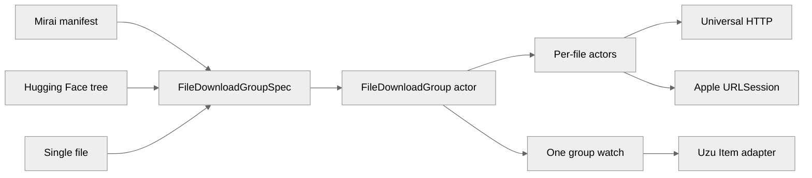
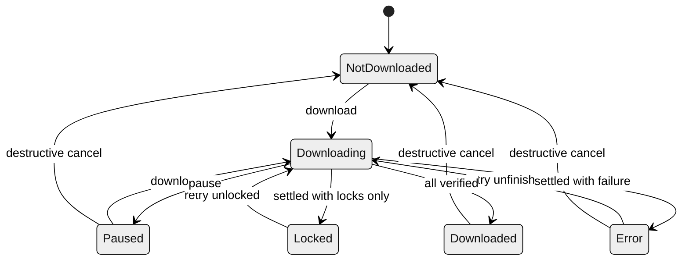

# File-group download lifecycle

The shared downloader works with a group of files. A model source only discovers files; it does not control downloads. Mirai manifests, Hugging Face repositories, and a single URL all become the same validated `FileDownloadGroupSpec`.

The group owns model-level commands and state. Each file still uses the existing per-file actor, backend task, generation number, and destination lock.

## Opening a group

`FileDownloadGroup::open` first validates the full specification. It rejects:

- an empty group;
- absolute paths and `.` or `..` path components;
- duplicate destinations;
- a path that is both a file and a parent directory;
- symlink escapes below the declared destination root;
- invalid byte sizes or an overflowing known total.

After validation, the group probes for existing destinations, manager artifacts, cached tasks, and live Apple background tasks. Those members attach immediately. A completely untouched member stays lazy: its per-file actor is created only when `download()` or destructive `cancel()` needs it.

One live group owns a normalized destination root process-wide. Opening the same specification reuses that group. A different or overlapping specification returns `RootConflict`. If the last handle is dropped during a command or transfer, the root stays reserved until the actor and active children settle.

## Group state

`FileDownloadGroupState` is a complete snapshot, not an event delta. It contains the phase, byte progress, file counts, and all current failures.

The group chooses its phase in this order:

| Condition | Group phase |
| --- | --- |
| Any member is active | `Downloading` |
| No member is active and any ordinary failure exists | `Error` |
| Every failure is a foreign lock | `Locked` |
| Every member is verified | `Downloaded` |
| Some work is complete or paused | `Paused` |
| Nothing has started | `NotDownloaded` |

A failure is visible immediately in `failures`, even while another file is still downloading. One failed member does not stop independent members.

Known byte counts stay available in every phase. `total_bytes == None` means at least one member has an unknown size. Zero is a real total, not the marker for “unknown.”

## Attempts and commands

`download()` starts every unfinished member immediately and returns a `DownloadAttempt`.

An attempt has its own actor-assigned ID and completion channel. `attempt.wait()` can only observe that attempt. A terminal state from an earlier or later attempt cannot satisfy it.

Calling `download()` while an attempt is active returns another handle for the same attempt. A retry starts only missing, failed, paused, locked, or unverified members. Verified files are left alone.

`pause()` asks every active member to stop and preserve resumable data. A member that finishes while the pause command is being processed is treated as settled, not as a pause failure.

`cancel()` is deliberately destructive. It quiesces members in deterministic path order, then removes only files owned by the specification:

- completed destinations;
- per-member `download.part` and `download.resume_data` files;
- versioned `recovery.json`, integrity receipts, and their staging files;
- owned lock files;
- owned staging files.

It tries every member and returns every cleanup error. The group publishes `NotDownloaded` only when cleanup succeeds. It removes an empty manager-owned group directory, but never recursively deletes the destination root or a manager directory containing unrelated files.

Dropping a group stops its aggregation actor, but it does not cancel an active transfer. The root stays reserved until active members settle. Settled per-file actors are then evicted while their destination and recovery artifacts remain; reopening the group rebuilds and reconciles those actors, or reattaches an Apple background task that is still running.

## Model resolution

Mirai and Hugging Face stop at the same boundary: both produce a `FileDownloadGroupSpec`; neither source owns download lifecycle.

Mirai maps each manifest file to its relative path, byte size, URL, and CRC32C check. Hugging Face first resolves a requested revision to a full commit SHA, walks the recursive repository tree through every pagination link, and pins every file URL to that commit. LFS entries use SHA-256; ordinary Git entries use Git-blob SHA-1. The immutable tree is cached by repository and commit, so an exact cached commit can resolve offline.

The Hugging Face token is added to metadata and file requests through a redacted in-memory header value. Repository paths are validated before they become `RelativeFilePath` values, and one invalid model is reported without preventing other storage items from loading.

## Per-file safety rules

The per-file actor is the single owner of live state. State and its typed failure are published together as one atomic `FileDownloadSnapshot`. Backend callbacks include a generation number, so a late callback from an old task cannot change a new task.

Resume artifacts use a stable canonical destination ID. Files such as `weights.bin` and `weights.safetensors` therefore cannot share a partial file or lock, including through case, Unicode-normalization, relative-path, and symlink aliases on platforms where those aliases are equivalent.

Each resumable file has versioned recovery metadata containing the destination identity, a one-way URL fingerprint, expected size, and integrity rule. A restart resumes only when every field matches. A changed request discards the stale partial file. Authorization headers and signed URL text are never serialized.

Manager state is kept beside the destination root so staging and final files share a filesystem:

| Artifact | Location |
| --- | --- |
| Group state | sibling `.uzu-download-manager/<root-id>` |
| Mount-point fallback | collision-safe hidden directory inside the destination root |
| Member state | `<group-state>/<member-id>` |
| Cross-process lock | temporary manager state `uzu-download-manager/locks/<member-id>.lock` |

Apple installation uses a cancellation barrier. A delegate either finishes its final move before destructive cleanup starts, or sees the tombstone and does not install the file. A late callback cannot recreate a canceled destination. Both Apple and Universal installation recheck destination and artifact ancestors before the final atomic rename.

Completed files are checked with one streaming read:

- CRC32C for Mirai files;
- SHA-256 for Hugging Face LFS files;
- Git blob SHA-1 for ordinary Hugging Face files;
- no check only for generic callers that explicitly choose `FileCheck::None`.

An integrity mismatch marks the destination invalid. An I/O error is different: the downloader reports it but does not delete a file that may still be valid.

HTTP responses are checked before installation. Authentication and missing-source responses are not retried. Rate limits, server errors, and transport failures use the existing bounded retry policy. Bearer values are kept in redacted memory-only headers and are not written to recovery metadata or task descriptions. Authenticated Apple requests use an ephemeral session because opaque background resume data can retain request secrets.

## Uzu model state

Uzu's `Item` is a compatibility adapter around one `FileDownloadGroup`. It maps the group snapshot to the existing Swift, Python, and TypeScript `DownloadState` API.

There is no second model reducer, file-task fan-in, pending-event queue, or local state cache. The group watch is the source of model download progress.
